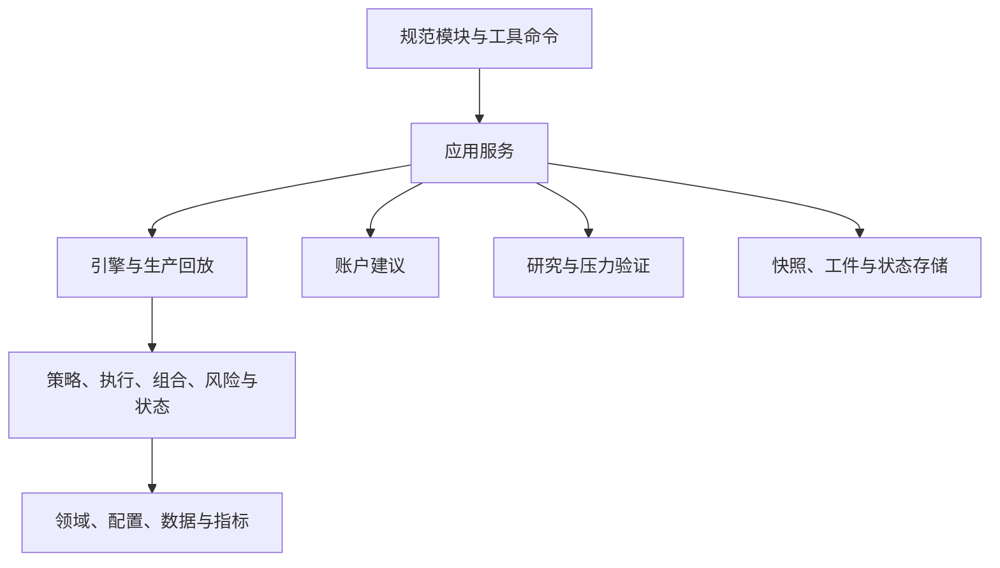

# Quant Fusion 模块架构

## 设计目标

本仓库采用单进程模块化单体。工程边界隔离变化原因，不凭文档整理改变策略参数、信号顺序、撮合顺序、组合核算、风险动作或生产回放语义。全部 Python 实现与公共导入位于 `quantfusion/`；根目录不保留历史模块名或重复命令行文件，独立工具通过 `python -m scripts.<模块名>` 启动。

## 单向依赖



`tests/contract/test_architecture.py` 守卫依赖方向：领域层不反向依赖引擎或应用；跨子包不导入私有名称；规范模块导入图无环；已删除的根模块及其旧名称导入不得恢复；根目录只保留文档与项目配置。

## 模块所有权

| 目录 | 唯一主要职责 | 禁止承担的职责 |
|---|---|---|
| `domain/` | 稳定领域模型、交易规则与通用校验 | 网络、文件、命令行和引擎编排 |
| `config/` | 默认参数、组合政策、风险政策、生产股票池与研究股票池事实源 | 成交、回放和工件写入 |
| `data/` | 行情契约、提供方、显式缓存和冻结快照 | 策略决策和账户核算 |
| `indicators/` | 无副作用技术指标 | 数据抓取和交易状态 |
| `strategy/` | 趋势与弱市信号 | 总账户资金和文件系统 |
| `execution/` | 执行优先级等稳定撮合规则 | 研究参数选择 |
| `portfolio/` | 组合状态、资金核算与分配边界 | 命令行和网络 |
| `risk/` | 组合风控、治理证据和跨市场叠加层 | 应用流程和研究晋级 |
| `regime/` | 指数证据与纯状态转换 | 持续账户和工件发布 |
| `engine/` | 单袖套、组合引擎和生产逐日回放 | 命令行解析和研究搜索 |
| `account/` | 严格同日账户快照、候选评分和非执行性数量估算 | 历史回测状态注入、跨日账户账本和券商订单 |
| `research/` | 候选、走步评价、晋级门和研究工件 | 复制撮合或交易逻辑 |
| `application/` | 回测、模拟日扫、账户建议、优化、股票池比较报告和压力流程编排 | 重复领域实现 |
| `io/` | 严格工件、连续状态和原子文件发布 | 策略与风险判断 |

## 生产与研究股票池边界

`quantfusion/config/universe.py` 是生产日扫、正式压力计划和固定回归的 17 股唯一有序事实源。其顺序、验证前缀和现有正式证据身份不因研究扩池改变。`quantfusion/config/research_universes.py` 单独保存 Pool A–J 的名称、描述和有序 symbol；研究池可以包含生产池外的已映射科技标的，但不能反向修改生产 `SYMBOL_NAMES`。

研究标的继续复用 `config/profiles.py` 的合法参数画像、`config/overlay.py` 的行业归属和现有风险实现。新增研究 symbol 的行业映射只用于让既有集中度与风险分组正确识别实际持仓；固定 `RISK_BASKET`、固定信号参考、风险阈值和参数工厂不随 Pool 自动扩大。证券名称的研究事实源是 `RESEARCH_SYMBOL_NAMES`；历史画像注释只说明参数类别，不作为 symbol-name 映射。

`quantfusion/application/backtest_cli.py` 可选择单个 `--pool`，但仍调用原 `BacktestEngine`；`scripts/compare_universes.py` 通过 `ProductionReplayEngine` 做连续账户比较，并复用相同费用、T+1、撮合、风险与路由。股票池配置层不实现策略分叉，也不为每个 Pool 复制策略代码。

市场数据准备统一由 `scripts/download_market_data.py` 完成，默认写入被忽略的独立缓存并复用当前 provider failover；不存在单独的旧无 Pool 下载分支。manifest 在外部 I/O 前先标记不完整，每个 CSV 原子替换并记录 SHA-256；只有全部请求股票完成才可形成完整输入，Pool 请求还必须覆盖对应固定参考和风险篮股票。`scripts.compare_universes.py` 在回放前重新核验完整 manifest、文件哈希、股票截止日覆盖和两只固定指数的路由预热／同步覆盖，避免数据缺口被当成策略现金防御。

比较报告属于只读应用派生物。它从实际引擎结果和成交重建换手、现金比例、风险事件与持仓 HHI，分别保存请求窗口和实际观察窗口；不写策略状态、不更新生产风险状态、不改 canonical 工件。默认 `reports/universe_comparison/` 是被忽略的运行输出目录。

## 模拟与账户两条调用链

模拟回测、模拟日扫、优化器和压力验证复用规范引擎或 `ProductionReplayEngine`。研究层只产生候选配置和评价请求，不复制信号、费用、涨跌停、成交量容量、T+1 或资金核算。生产回放只接收通用 `ReplayRuntimePolicy` 能力，不识别 C6 intervention 身份；冻结 C6 请求的校验、身份到通用能力的映射以及非 canonical 诊断入口归 `quantfusion/research/c6_runtime.py` 所有。生产回放的路由变化保留同一个模拟账户中的现金、持仓、挂单、袖套、峰值、风险锁和冷却，不在边界重新建账。

真实账户建议由 `application/account_scan.py` 消费严格同日快照，按单次请求的行情和指标评价持仓处置与买入候选。它不是“把真实持仓注入历史模拟”，不恢复历史挂单、冷却、路由计数或券商账本。其买入候选是收盘价下的人工复核数量，不是生产袖套净订单。

公共代码从 `quantfusion.config`、`quantfusion.data`、`quantfusion.domain`、`quantfusion.engine`、`quantfusion.risk` 与 `quantfusion.application` 的当前模块导入，不恢复旧根模块 wrapper。

## 默认账户风险预算

`risk/account_budget.py` 的纯计划函数同时服务模拟回放与真实账户建议，只评价风险预算并生成削减计划，不创建新资本分配器。三袖套在合并账户上统一评价，单账户与强制弱市在其相应账户收盘评价；计划交给各自既有适配器，不复制执行引擎。

普通路径在保留策略有效持仓时，仅当同时满足以下条件才推迟按比例持仓减仓：总敞口超出额度不重大（不超过 `daily_loss_limit × equity`）、剩余损失预算仍充裕（至少为两日规划压力包络的 85%）、且 `equity / peak ≤ 0.9245`（近峰值收紧带）。任一条件不满足则仍按比例为储备金减仓。预警、冲击、直接亏损、集中度、弱账本、锁定与失败关闭路径不推迟。

回放使用 `RiskAction`、挂单和下一可交易日开盘执行，输出 `account_risk_budget`；只有实际完成评估才标记 `APPLIED`，模拟日扫拒绝缺少实际预算回执的正常发布。真实账户使用快照现金、实际持仓和 `peak_equity`，本次权益创新高只能提高计算峰值，不能降低原峰值、重置回撤或虚构历史。

纯计划不改写账户账本，执行适配器保持先卖后买、同账本防御卖单否决回补和可卖数量限制。未成交的卖单不能增加买入额度。必要估值或市场证据不足时，账户回执为 `NOT_READY` 并抑制新增风险，不把开关开启等同于数据充分或实际成交。研究消融必须显式声明关闭配置及独立证据身份，不能作为当前默认结果。

预算公式、不同风险层的口径与恢复限制分别见实现及[使用说明](../README.md)。预算基准、交易触发线和正式验收目标不是同一概念。

## 状态所有权

| 状态 | 所有者 | 生命周期与边界 |
|---|---|---|
| 模拟现金、持仓、挂单与成交 | 引擎 | 一次连续回放；路由切换不重建 |
| 袖套、风险峰值、锁与冷却 | 引擎和风险层 | 同一次回放中跨路由保留，恢复遵循各自政策 |
| 外层路由确认计数 | 状态机与生产回放 | 按因果日期序列计算，不由报告改写 |
| 跨市场风险证据与动作 | 风险叠加层和执行适配器 | 每日更新，执行权明确，避免与专用弱市重复动作 |
| 模拟日扫 `risk_state.json` | 应用层状态存储 | 用于跨日显示和身份连续性核对，不作为重建历史回放的输入 |
| 模拟冻结行情快照 | 快照模块 | 同一目标日期及其 manifest／哈希身份不可静默覆盖 |
| 真实账户快照及历史峰值 | 使用者提供，账户入口校验 | 单次同日输入；本次估值创新高不自动写回输入文件 |
| 账户本次行情和指标 | 账户应用内存 | 每股单次准备，供持仓、评分及数量计算复用 |
| 优化器候选与晋级证据 | 研究层 | 一次来源绑定、可续跑的研究，不与日扫状态混用 |
| Pool A–J 研究数据和比较报告 | 研究工具与应用报告层 | 独立目录、来源绑定；不进入生产日扫状态或正式压力发布 |

账户建议不能通过复制模拟 `risk_state.json` 获得真实账户连续性。任何模式都不应以删除状态、降低历史峰值或修改身份字段作为解除真实风险的办法。

## 市场状态路由与板块守卫温度计

产品用两套不同口径的外部参考，不要理解成「交易池自己给自己当裁判」：

1. **固定指数（路由）。** `000300`（沪深300）与 `000682`（科技相关）驱动市场状态机的趋势／过渡／震荡与弱市边界；配置见 `quantfusion/config/regime.py`。
2. **固定个股篮 `regime_symbols`（板块守卫）。** 默认五只为 `300308`、`300502`、`300394`、`688008`、`603986`。引擎用其等权收益与广度判定 sector guard 的冲击与恢复；日扫将其行情标为「市场状态参考」，即使某代码不在当前交易池也会拉取。

该五只名单是**故意与交易池解耦的固定温度计**：跨池可比、正式路径可复现。成员不必等于生产 17 池或 `--symbol` 当日集合——例如 `688008` 可以不在生产池仍担任裁判。更大的 `RISK_BASKET` 服务跨市场叠加层，不自动改写这五只。

当前默认不把板块守卫改绑到交易池、不按收益自动重选裁判、也不把冲击／恢复改成仅看宽基或科技指数。那些改法会改变守卫触发时点，并在已测验证池上相对当前默认变差；若将来改动，须当作有意经济变更并重跑对照与正式验收，不能当作无感文档同步。

固定窄篮的已知代价是单票异常仍可能扰动等权与广度；产品接受该代价，以换取稳定温度计与当前已验收的经济路径。

## 风险动作与治理边界

跨市场叠加层先生成不可变风险动作，再由适配器翻译成既有卖出信号并写入挂单队列：

```text
RiskEvidence -> RiskPolicy -> RiskAction -> EngineAdapter -> pending signal
```

政策层不直接依赖挂单容器，适配器保持原有顺序、数量、原因、优先级和冷却语义。专用弱市／现金路径与叠加层的执行权不同，观察风险不意味着必须重复下达动作。

治理计算读取既有状态形成健康、共识和风险意见，不直接改写交易账本；独立 `risk_opinion` 也不直接产生交易。模拟日扫另外消费 `warmup_health`，当 `warmup_status=INVALID` 时抑制全部新增买入，`DEGRADED` 本身只提示，`READY` 表示该健康检查通过。因而“治理输出完全不影响任何决策”不是准确描述。风险事件后续收益和校准窗口属于事后分析，不回流为当时的因果输入。

## 机器结果与派生报告的发布

### 模拟日扫

`application/daily_scan.py` 的实际顺序如下，不能交换为先保存状态再验证结果：

```text
验证请求、风险状态身份和行情
  -> 冻结并校验证据快照
  -> 运行生产回放并校验结果、实际预算回执
  -> 应用预热和当前路由等买入限制
  -> 原子写入机器信号（risk_state_saved=false）
  -> 身份匹配时保存连续性状态
  -> 回写信号中的保存状态；写入失败则本次运行失败
  -> 无状态保存错误时更新 latest_success.json；写入失败则本次运行失败
  -> 生成终端中文阅读版和来源绑定的 Markdown
```

这不是多文件整体事务。快照、回放结果或序列化失败时不会进入正常信号与状态发布；部分路径尽力写独立 `.error.json`，但不保证每次失败都有回执文件。机器信号写入失败不会先提交新风险状态；风险状态保存失败则可能已有本次 JSON，命令返回失败，成功索引不推进，也不生成本次正常中文报告。

状态标记回写与成功索引更新是尽力操作，不能仅凭文件存在或某个旧指针认定本次成功。索引可能仍保留旧 `run_id`，而同日机器文件已有新内容；应联合核对退出状态、文件身份、状态标记和终端错误。

身份不匹配与写盘失败不同：前者保留原状态、抑制买入，但可发布仍能解释卖出信号的受限结果，成功索引也可能更新。不得将其写成完整正常买入判断，更不能通过删除原状态强行解除限制。

### 真实账户建议

```text
读取账户文件的同一份字节并计算 SHA-256
  -> 严格校验 schema、账户及请求日期
  -> 准备指数与单次账户行情、指标
  -> 评价持仓、候选、完整性与共享账户预算
  -> 原子写入 account_signals_<日期>.json
  -> 根据该 JSON 生成派生中文报告
```

账户入口不写模拟快照、`risk_state.json` 或 `latest_success.json`。合格的防御结果可以包含 `BLOCKED`、`DATA_ERROR`、`NOT_READY` 或全部禁止买入；JSON 保存成功不等于所有证据充分。已捕获异常返回失败，未捕获异常和各输出步骤不保证采用相同退出码，也没有统一的账户错误 JSON 协议。

### 中文报告

现有 `publish_daily_report` 只在相应原流程结束后读取已发布 JSON，并核对预期 `run_id` 或 `account_snapshot_sha256`。Markdown 文件名包含来源哈希前缀，正文记录完整 JSON 字节 SHA-256；报告不是新成功指针、券商订单或新的授权。

报告解释已有记录，不重新计算策略、风险和数量；来自本次回放内存的补充事件单独标明日期和证明边界。派生报告生成或保存失败不回滚既有机器工件和状态。消费者不能通过删除旧报告、挑选一份好看的结果或只核对日期来认证本次运行。

### Pool 比较报告

`application/universe_comparison.py` 只消费已经完成的生产回放结果和只读行情帧。它不重新生成信号，不调策略参数，也不拥有风险状态。换手使用实际成交总额和平均资产；全现金与平均现金比例来自权益曲线；持仓 HHI 由实际成交重建股数，再使用各组合日截至当时最后可见的收盘价估值，停牌时不读取未来价格。

报告同时保存请求窗口和权益曲线真实首尾日期、成员代码／名称、风险事件类型和数据身份。股票 manifest 或固定指数证据不完整时，比较在引擎运行前失败；实际权益覆盖明显短于请求窗口时，比较在报告发布前失败。JSON／CSV／Markdown 是同一次研究运行的不同视图，默认目录被忽略，不能手工复制到 `artifacts/validation/` 获得 canonical 身份。

## 显式数据上下文

行情缓存目录通过 `cache_dir` 从应用请求逐层传入提供方，不使用进程级可变缓存目录。不同任务需使用合适的独立运行路径，不能据此假定共享同一输出目录的并发写入已被自动协调。

真实账户中，提供层标记陈旧、必要候选缺失或实际行情截止日不一致会抑制新增买入，已有可用持仓的防御提示仍可能保留。默认自适应回放对不可观察的请求股票失败，显式研究过滤与弱市内部资格筛选另有边界，见[数据说明](../data/README.md)。

日扫指数刷新使用传入的 `regime_data_dir`，日扫默认值为独立运行目录 `data_cache/regime`；仓库冻结指数目录受写保护。状态机的 `boundary_route` 取最后一个可用指数日；`decide_current` 将既有 `detect_regime` 的 `unknown` 结果作为统一现金防御条件，旧路由不能覆盖无效当前证据。该检查不改变既有十个自然日的新鲜度容忍、状态机或历史回放；模拟日扫和账户建议入口还会校验沪深交易日日历及应覆盖日；日历仅覆盖 2024–2026 年，缺少必要指数的目标交易日时失败关闭，自然日容忍不能绕过入口校验。

Pool 比较使用同一状态机，但额外要求固定指数在研究起点前已有 MA120 预热观测，窗口内两只指数日期集合一致且截止日未超过既有新鲜度界限。该研究检查防止缺失指数导致的现金路径污染股票池比较，不改变状态机阈值或日扫交易日合同。

## 仓库资产与配置事实源

规范代码位于 `quantfusion/`，研究工具位于 `scripts/`，测试按单元、契约、集成和经济回归分层。冻结股票与指数位于 `data/market/`、`data/regime/`，黄金预期位于 `tests/fixtures/`，已审查结果位于 `artifacts/validation/`，非真实账户样例位于 `examples/`。

规范仓库路径由 `quantfusion.config.paths` 提供，用户显式传入的数据目录按普通 `Path` 处理，不因名称映射到别的目录；应用可执行 `expanduser()`／`resolve()` 等常规规范化。运行缓存、日扫输出、优化结果和检查点不得混入冻结输入或已审查证据。

| 配置职责 | 唯一来源 |
|---|---|
| 引擎默认值、合法逐股覆盖和校验 | `quantfusion.config.engine` 的 `default_engine_config()`、`PER_SYMBOL_OVERRIDE_KEYS`、`validate_engine_config()` |
| 组合政策及校验 | `quantfusion.config.portfolio.PortfolioPolicy` |
| 风险叠加 | `quantfusion.config.overlay` |
| 路由与弱市 | `quantfusion.config.regime`、`quantfusion.config.weak` |
| 行业分类、符号路由、参数画像构造 | `quantfusion.config.profiles` |
| 生产股票名称、有序 17 股和正式验证前缀 | `quantfusion.config.universe` |
| Pool A–J 研究名称、描述和有序成员 | `quantfusion.config.research_universes` |

引擎与应用读取这些来源，不复制默认值；`config/profiles.py` 组合引擎默认值，`engine.py` 不提供同名画像 wrapper。普通业务模块超过约一千行或单函数超过约一百二十行时审查其职责，而不是仅为达成行数目标拆分。日扫保留有序发布编排，其快照、信号、工件和状态支持实现分别承担职责。

`pyright quantfusion` 覆盖规范包。类型配置不读取第三方库实现推断 pandas 类型；协作式 mixin 仅关闭无法从单文件推断的组合属性诊断，其他参数、返回值、可选值和导入检查仍生效。

## 压力与证据发布边界

`stress_scenarios.py` 构造和选择计划，`stress_metrics.py` 计算指标及门禁，`stress_artifacts.py` 校验检查点与控制发布，`stress.py` 负责参数、编排和退出码。场景与验收的完整数量、当前基线、来源哈希和适用限制集中在[验证结果与证据](VALIDATION.md#formal-stress-evidence)，不在本文件复制。

风险、财富比较与诊断统计由当前验收规则统一评价。任何 ID、family、ID 文件或 shard 选择都属于诊断，输出与正式发布隔离，不能更新 canonical 工件。正式发布要求完整场景覆盖、来源一致性及适用验收通过。

正式写入前，prefix 与 universe 的共同场景记录必须逐条相等，排序差异不影响比较。读取账户预算 incumbent 时重算已有记录、门禁与发布评估，并检查来源、固定参考和 L2 上下文；历史经济源码不必等于后来维护程序 HEAD。读取内部一致性不是数字签名，更不是重新认证全部外部原始对象。

当前完整指标以按族和 seed 的小型表保存，`scripts.release_tables` 负责复核和导出：重建完整指标后，经原生身份、固定参考和重新计算的验收验证才原子写出，不修改日常决策。

当前文档只描述现行实现和能力；不可变证据及 Git 对象保留其来源身份，不构成新的执行授权。项目入口见[项目 brief](../.github/PROJECT_BRIEF.md)。

## 扩展方式

新增策略在 `strategy/` 实现信号，在 `config/` 提供唯一配置来源，通过引擎公开注册边界接入，不复制日扫、优化器撮合或账户存储。新增提供方在 `data/providers.py` 适配并复用列名、单位、日期和新鲜度契约，不让策略访问网络。

新增研究股票先在 `research_universes.py` 建立明确名称／代码身份，并复用或补齐现有行业／画像元数据；不得把研究标的直接追加到生产 `SYMBOL_NAMES` 作为切池方式。研究数据和报告使用独立目录，未通过输入完整性检查时停止，不通过删股、补未来值或改风险阈值继续。

新增风险规则在 `risk/` 生成证据或不可变动作，需要成交时进入现有执行适配器；纯观测计算不改账户状态，应用层需要消费健康门时明确其独立职责。新增应用在 `application/` 组合公开服务，独立工具在 `scripts/` 以模块启动，根目录不增加 Python CLI，参数解析对象不传入领域层。

## 验证范围

验证范围由 [AGENTS.md](../AGENTS.md) 与当前任务的适用合同确定。先验证受影响范围；涉及相应经济行为或合同明确要求时，执行正式经济验收。纯文档变更不主动触发无关回测；当前 HEAD 仍须满足适用工程检查与仓库合并保护。

受影响检查与适用的 required checks 均须满足，文档或工程检查通过不能替代经济验收。CI 的实际 Python 版本覆盖和结果证据分类见验证说明。