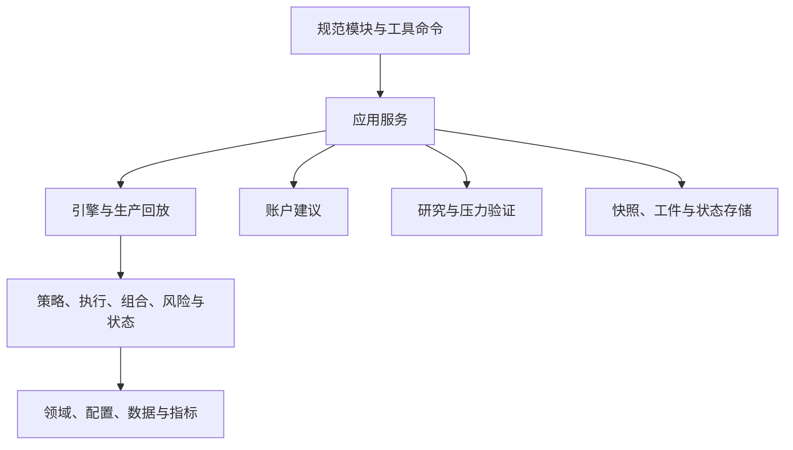

# Quant Fusion 模块架构

## 设计目标

本仓库采用单进程模块化单体。工程边界用于隔离变化原因，不改变策略参数、信号顺序、撮合顺序、组合核算、风险动作或生产回放语义。

全部 Python 实现与公共导入位于 `quantfusion/`。根目录不保留历史模块名或重复命令行文件；工具统一通过 `python -m scripts.<模块名>` 启动。

## 单向依赖



依赖方向由 `tests/contract/test_architecture.py` 自动守卫：

- 历史根模块必须不存在，规范包禁止导入其旧名称；
- 领域层禁止反向依赖引擎或应用层；
- 跨子包禁止导入私有名称；
- 规范模块导入图必须无环；
- 根目录只保留文档与项目配置。

## 模块所有权

| 目录 | 唯一主要职责 | 禁止承担的职责 |
|---|---|---|
| `domain/` | 稳定领域模型、交易规则与通用校验 | 网络、文件、命令行和引擎编排 |
| `config/` | 默认参数、组合政策、风险政策和股票池事实源 | 成交、回放和工件写入 |
| `data/` | 行情契约、提供方、显式缓存和冻结快照 | 策略决策和账户核算 |
| `indicators/` | 无副作用技术指标 | 数据抓取和交易状态 |
| `strategy/` | 趋势与弱市信号 | 总账户资金和文件系统 |
| `execution/` | 执行优先级等稳定撮合规则 | 研究参数选择 |
| `portfolio/` | 组合状态、资金核算与分配边界 | 命令行和网络 |
| `risk/` | 组合风控、治理证据和跨市场叠加层 | 应用流程和研究晋级 |
| `regime/` | 指数证据与纯状态转换 | 持续账户和工件发布 |
| `engine/` | 单袖套、组合引擎和生产逐日回放 | 命令行解析和研究搜索 |
| `account/` | 严格同日账户快照、候选评分和非执行性数量估算 | 历史回测状态注入、账户账本和券商订单 |
| `research/` | 候选、走步评价、晋级门和研究工件 | 复制撮合或交易逻辑 |
| `application/` | 回测、日扫、账户、优化和压力流程编排 | 重复领域实现 |
| `io/` | 严格工件、连续状态和原子发布 | 策略与风险判断 |

## 执行事实源

回测、日扫、优化器、股票池验证和压力验证最终都调用规范引擎或 `ProductionReplayEngine`。研究层只产生候选配置和评价请求，不能复制信号、费用、涨跌停、成交量容量、T+1 或资金核算。

公共代码直接从 `quantfusion.config`、`quantfusion.data`、`quantfusion.domain`、`quantfusion.engine`、`quantfusion.risk` 与 `quantfusion.application` 的当前模块导入。

## 状态所有权

| 状态 | 所有者 | 生命周期 |
|---|---|---|
| 现金、持仓、挂单与成交 | 引擎 | 一次连续回放 |
| 袖套、峰值、风险锁与冷却 | 引擎和风险层 | 路由切换时保留 |
| 外层路由确认计数 | 状态机与生产回放 | 一次连续回放 |
| 跨市场风险证据与动作 | 风险叠加层 | 每日更新并由适配器执行 |
| 日扫连续风险状态 | 状态存储 | 成功工件发布后更新 |
| 冻结行情证据 | 快照模块 | 同一交易日不可改写 |
| 优化器候选与晋级证据 | 研究层 | 一次可续跑研究任务 |

任何路由变化都不得重建账户、清空挂单、重置峰值或丢失冷却状态。

## 风险动作边界

跨市场叠加层先生成不可变 `RiskAction`，再由适配器翻译成既有卖出信号并写入挂单队列：

```text
RiskEvidence -> RiskPolicy -> RiskAction -> EngineAdapter -> pending signal
```

政策层不再直接依赖挂单容器结构。适配器保持原有顺序、数量、原因、优先级和冷却语义。

## 日扫事务

日扫应用按照以下不可交换的顺序发布结果：

```text
验证请求与行情
  -> 冻结并校验证据快照
  -> 运行生产回放
  -> 验证严格结果结构
  -> 写入本次信号工件
  -> 写入连续风险状态
  -> 原子更新 latest_success
```

前一步失败时不得发布后续状态。最后成功工件在新运行失败时必须保持可用。

## 显式数据上下文

行情缓存目录通过 `cache_dir` 从应用请求逐层传入数据提供方。`DataFetcher` 不保留进程级可变缓存目录，因此并行任务和连续运行不会相互污染数据路径。

账户建议另有更窄的事实边界：只接受严格 v3 同日快照，并在单次请求内为每只股票冻结一份局部行情与指标。提供层标记的 stale 缓存、候选缺失或实际行情截止日不一致都会抑制全部新增买入；持仓卖出风险提示仍按可用证据独立产生。该边界不恢复挂单、冷却、路由或风险状态，不维护跨日账本，也不输出券商订单。

## 仓库资产边界

规范代码与仓库资产分开管理：`quantfusion/` 只放可导入实现，`scripts/` 放可复现研究命令，`tests/` 按单元、契约、集成和经济回归分层。冻结股票行情位于 `data/market/`，路由证据位于 `data/regime/`，测试读取的黄金指标位于 `tests/fixtures/`，已审查批量结果位于 `artifacts/validation/`，账户输入样例位于 `examples/`。

canonical 仓库路径由 `quantfusion.config.paths` 提供。用户显式传入的数据路径始终按普通 `Path` 处理，不按目录名称映射到 canonical 路径；应用可以执行 `expanduser()` / `resolve()` 等常规规范化。运行缓存、日扫输出、优化器输出和压力检查点属于临时状态，受 `.gitignore` 隔离，不得混入冻结数据或已审查工件。根目录只保留文档与项目配置。

## 公共配置事实源

- 引擎默认值与校验分别来自 `quantfusion.config.engine.default_engine_config()` 和 `validate_engine_config()`；
- 组合政策来自 `quantfusion.config.portfolio.PortfolioPolicy`；
- 风险叠加参数来自 `quantfusion.config.overlay`；
- 路由与弱市参数来自 `quantfusion.config.regime` 和 `quantfusion.config.weak`；
- 行业分类、符号路由和参数画像构造来自 `quantfusion.config.profiles`；
- 固定股票名称和验证股票池来自 `quantfusion.config.universe`。

引擎与应用只读取以上公共来源，禁止复制默认值。

## 规模与类型约束

普通业务模块超过约一千行或单函数超过约一百二十行时必须审查。`config/engine.py` 是默认值、可按标的单股覆盖字段与配置校验的唯一事实源；`config/profiles.py` 组合这些默认值并唯一拥有行业分类、符号路由和画像构造，engine 不提供同名 wrapper。`application/daily_scan.py` 保留不可交换的事务顺序编排，其快照、信号、工件和状态实现已拆出。

压力执行按四个直接职责分开：`application/stress_scenarios.py` 构造及选择计划，`stress_metrics.py` 计算汇总和门禁，`stress_artifacts.py` 校验检查点与控制发布，`stress.py` 只负责参数、编排和退出码。合同 v2 将所有正式场景 `abs(max_drawdown) <= 0.18` 与账本上限放在 absolute hard gates；9→10 与最差相邻前缀财富保护属于 retained robustness hard gates；add-one 相对终值及其配对回撤、成交、桶和锁变化只属于 robustness diagnostics；已有 incumbent 的相对非回归属于 promotion gates。整体接受要求两个 hard-gate family 同时通过。任何 ID、family、ID 文件或 shard selector 都产生 diagnostic 计划；诊断检查点和输出与正式验证 namespace 隔离，只有未经筛选且与 canonical 默认场景计划精确一致的运行可以调用正式发布边界。没有 v2 incumbent 时，发布还要求显式的一次性首基线动作及独立当前语义参考工件，并对 hard gates、收益保护、排列不变性和 provenance 失败关闭。

`pyright quantfusion` 覆盖整个规范包。由于 pandas 本身未提供随包类型声明，配置不读取第三方库实现来推断类型；协作式 mixin 文件仅关闭无法从单文件推断的组合属性诊断，其余参数、返回值、可选值和导入检查继续生效。

## 扩展方式

### 新增策略

在 `strategy/` 增加信号实现，在 `config/` 增加唯一默认来源，并通过引擎公开的策略注册边界接入。不得修改日扫工件、优化器撮合或账户存储。

### 新增行情提供方

在 `data/providers.py` 增加提供方适配，并复用相同的列名、成交量单位、日期和新鲜度契约。不得让策略直接访问网络。

### 新增风险规则

在 `risk/` 产生证据或不可变动作；需要成交时通过执行适配器进入队列。纯观测规则不得修改账户状态。

### 新增应用入口

在 `application/` 组合现有公开服务；独立工具放入 `scripts/`，并只支持 `python -m scripts.<模块名>`。根目录不增加 Python 命令入口，参数解析对象不得传入领域层。

## 验证层级

- 小批次只运行改动文件编译、静态检查和受影响测试；
- 阶段边界运行对应集成契约与最小经济哨兵；
- 最终候选树集中运行完整测试、五股票池黄金回归、安全审计、依赖审计和正式压力矩阵。

该分层避免对每个中间状态重复做昂贵证明，同时保证最终候选树获得完整工程与经济验证。

<!-- CURRENT_FORMAL_STRESS_PLAN:START -->
<!-- CURRENT_FORMAL_STRESS_PLAN_META: {"symbol_count": 17, "scenario_count": 958, "family_counts": {"prefix": 17, "leave_one_out": 17, "add_one": 24, "random_subset": 750, "permutation": 150}} -->
## Formal stress 的当前边界

当前计划计数：17 股；958 场景；prefix=17；leave-one-out=17；add-one=24；random-subset=750；permutation=150。

日扫与 formal stress 读取同一个有序 17 股权威映射。场景生成器在该顺序上构造 958 个完整场景；诊断 selector、单场景、family 或 shard 运行永远不是 formal plan，不能发布 canonical 工件。正式发布同时校验计划完整性、scenario ID 唯一性、生产回放语义、provenance、absolute hard gates、retained robustness gates 和 promotion/initial-baseline 状态。

历史 22 股/983 工件属于不同 scenario/data/run fingerprint，不会自动迁移到当前计划。

<!-- CURRENT_FORMAL_STRESS_RESULT:START -->
完整计划已运行：`958/958`，唯一 scenario ID：`958`。工件状态为 `current_candidate`，acceptance 为 `rejected`，canonical 为 `false`；absolute hard gates passed=`False`，retained robustness gates passed=`False`。全场景最差最大回撤为 `-23.992778%`（`random-20260807-03-004`），17 股完整 prefix 的总收益为 `286.202912%`、最大回撤为 `-20.499296%`。当前候选：`artifacts/validation/candidates/stress-acf4cccf4117edb35e6beb57aa2f9004476c8b93-rejected.json`，SHA-256：`63ec19ab7cccd37ea140828c9e6423727044413bd425064bd580896d17cf927c`；source revision：`acf4cccf4117edb35e6beb57aa2f9004476c8b93`。详细 gates 与 provenance 见 `artifacts/validation/formal_stress_958_acceptance_summary.json`。
<!-- CURRENT_FORMAL_STRESS_RESULT:END -->
<!-- CURRENT_FORMAL_STRESS_PLAN:END -->
